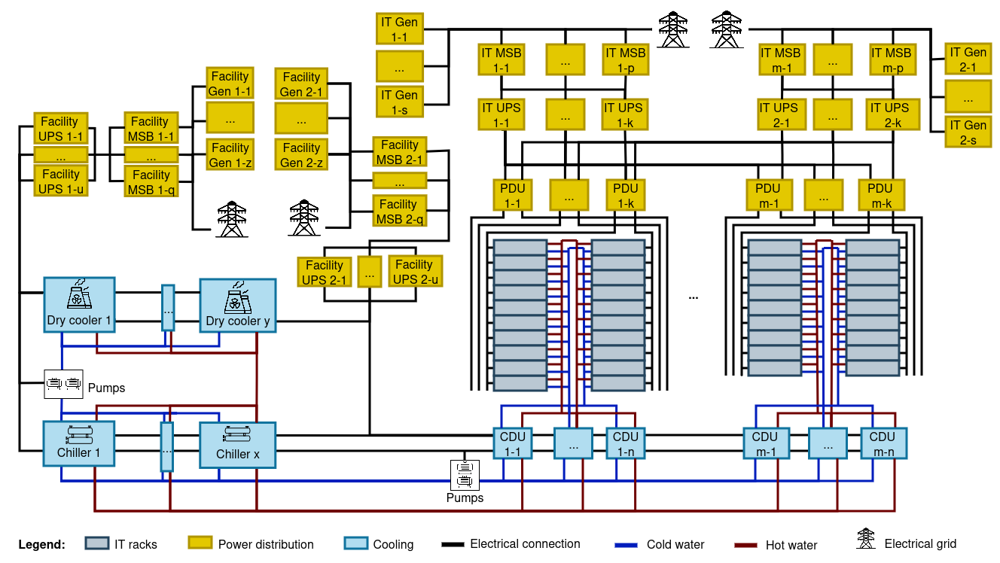

# DCGen - Datacenter Hardware Configuration Tool

> DCGen generates datacenter designs (IT, cooling and power distribution) to enable modeling of energy and power dynamics.
	The datacenter design outputs are JSON-encoded, incorporate commercial components, and can be directly input into simulation models.


## DCGen Key Capabilities

- **Realistic IT hardware designs** - Based on reference (e.g., xAI COLOSSUS, DGX SuperPOD, NVIDIA NVL576) and canonical models (e.g., 2024 racks)  
- **Cooling and Power Distribution Systems** - Industry-standard cooling and power distribution equipment
- **High scalability** - Model datacenters from small deployments (MW scale) to large   (GW)  scale facilities
- **Future projections** - Generate configurations for 2024, 2027, and 2029
- **Simulation-ready** - JSON output can be used directly in other simulation tools


## Installation

```bash
git clone https://github.com/WedanEmmanuel/DCGen-UChicago  # Download the tool
pip install -e .  #install the required packages
```
[](https://www.python.org/downloads/)

## Quick start with Examples of Datacenter Configurations
- Sample Python scripts  for AI training  configuration provided in [examples](./examples/) folder
- Sample inputs for AI training given in  [examples/Inputs](./examples/Inputs) 

- To run the examples, type the command below. Execution logs are saved in [examples/logs](./examples/logs).
	```python
	run-dcgen-examples  # Run all python examples of datacenter configurations  (in "examples/" directory)
	``` 

	or 
	```python
	cd examples 
	python3 AI_training.py   # Run AI training datacenter configuration 
	``` 

## Instructions to Generate Datacenter Configurations
- Create a new folder (Optional)
	```python 
	mkdir dir_name # Replace dir_name with the name you want to give your folder.
	cd my_dir
	```

- Edit input parameters (datacenter type and number of GPUs/total GPU power) in JSON files. One file per  datacenter. Example ```inputs_claud_3.json```. Use examples provided in [examples/Inputs](./examples/Inputs)  as a reference.

- Edit Python sripts to load the inputs, configure the datacenters, and display the results. Example ```configure_claud_3.py```.
Use the scripts provided in [examples](./examples/)  as reference. 

- Run the scripts and report the results. 
	```python 
	python3 script_name.py # Replace script_name to the actual file name. E.g., python3 configure_claud_3.py
	```


## Inputs
 - **datacenter_use_case**: one of four available use cases:  ```"AI training"```      or ```"AI inference"``` or ```"Mixed AI training and inference"```, or ```"Cloud"```. Example of parameter declaration: 
    ```python 
    "datacenter_use_case" : "AI training"
    ```


  - **datacenter_scale**:  specify the target (number of GPUs or total power consumed by GPUs), and the capacity (e.g., 1000 GPUs, 100 MW GPU power....). Examples of parameter definition:
    
    ``` python 
	"datacenter_scale":
	{ 
		'target' : 'gpu_count' #  Generate a datacenter with target total number of GPUs
		'capacity' : 10000    # E.g., 10000 GPUs in the target datacenter
	}
	``` 

	``` python 
	"datacenter_scale":
	{ 
		'target' : 'gpu_power' #  Generate a datacenter with target total power consumed but GPUs
		'capacity' : '100 MW'    # E.g., 100 MW of GPUs in the target datacenter
	}
	``` 

## Functions
Working examples of function calls are provided in [examples/AI_training.py](./examples/AI_training.py)

- **configure_target_datacenter(input_parameter)**: configures the target datacenter (IT, cooling, power distribution) with the inputs specified. You can provide```input_parameter``` as one of these: (1) a JSON file path containing the input data structure, (2) a JSON string, or (3) a python  dictionary.  

- **get_datacenter_it_configurations()**: gives the datacenter IT configurations. Example outputs: 

	```python
	"IT configuration": {
		"Datacenter (2024 Canonical Configuration)": { #Name of the reference configuration, by default, set to 2024 Canonical Configuration
			"Peak power (MW)": {  #Power demand broken down by type of IT hardware
				"GPU": 7.11,      #Power of GPU systems 
				"Storage": 0.387  #Power of storage systems 
			},
			"Rack count": {  ## Number of racks per hardware type 
				"GPU": 45,   #With  the 2024 Canonical Configuration, each GPU rack consumes 158kW, equivalent to 225 H200 GPUs per rack
				"Storage": 13 # With  the 2024 Canonical Configuration, each storage rack contains 42 storage servers  
			},
			"Power density (kW/m²)": 47.648,   # Amount of power consumed per m² in the IT area
			"Space Utilization (m²)": 185.4,    # Total space used by IT
			"Hardware Generation": "2024"      # Year of the reference model
		}
	}
	```
	Total IT Power: GPU power + Storage power


- **get_summary_cooling_system_configurations()**: gives a summary of cooling power and space. Example output:
	```python 
		"Cooling System": {
		"Datacenter (2024 Canonical Configuration)": { #Name of the reference configuration, by default, set to 2024 Canonical Configuration
			"Space Optimized Design": { #Cooling system design objective. By default, DCGen optimizes for space.
				"Maximum power demand (MW)": 24.957,  #Total cooling power demand
				"Space Utilization (m²)": { #Space required to deploy the system. Some equipment is install indoors, along the IT equipment, and others are outside to reject heat.
					"In datacenter Floor": 1085.7, #Space required inside the datacenter
					"Outside": 2689.0   #space required outside
				}
			}
		}
	}

	```
	Total Cooling Space (assuming outside equipment is not placed on the building’s roof): space in datacenter floor  + space outside


- **get_summary_power_distribution_system_configurations()**: gives a summary of  power overhead and space. Example output:
	
	```python 
		"Power Distribution System": {
		"Datacenter (2024 Canonical Configuration)": { #Name of the reference configuration, by default, set to 2024 Canonical Configuration
			"Space Optimized Design": { #Power system design objective. By default, DCGen optimizes for space.
				"Maximum power demand (MW)": 24.957,  #Total cooling power demand
				"Space Utilization (m²)": { #Space required to deploy the system. Some equipment is install indoors, along the IT equipment, and others are outside to reject heat.
					"In datacenter Floor": 1085.7, #Space required inside
					"Outside": 2689.0   #space required outside
				}
			}
		}
	}
	```
	Total Power Infrastructure Space (assuming outside equipment is not placed on the building’s roof): space in datacenter floor  + space outside


## Supported  Datacenter types

| Use Case | Description |
|----------|-------------|
| AI Training | GPU-dense configurations for AI model training |
| AI Inference | Optimized for serving (inferencing) workloads |
| Mixed AI training and inference | Combined training and inference |
| Cloud | General-purpose cloud infrastructure |

## Key Inputs
- **IT**
	- **Datacenter use case**: one of four datacenter types: AI Training, Mixed AI training and inference,  AI Inference, Cloud
	- **Target datacenter scale** 
		- **Power capacity**: Target power (e.g., `100 MW`, `1 GW`) or  
		- **Rack count**:  represents total compute capability
	- **Architecture description**: Number of racks arranged per row, number of rows grouped per pod.

- **Cooling and Power Distribution**
	- **Cooling and Power Distribution optimization objective**: Power Efficiency or Space Efficiency
	- **Redundancy Levels**: N+r and xN/y policies supported
	- **Safety margin**: additional capacity for safety and/or future IT growth 

## Computed Metrics

**IT Metrics**
- IT power demand
- Power density (kW/rack)
- White space requirements

**Cooling and Power Distribution Metrics**
-   Cooling Power demand and  Efficiency
-   Power Loss in the  Power Distribution System and Power Efficiency
-   Gray Space usage and Space Efficiency

## Architecture

DCGen generates datacenter designs including IT, cooling, and power distribution systems. 
The architecture (see Figure below) is configurable (racks per row, rows per pod, redundancy levels, etc.).



## Documentation

- [Detailed Usage Guide](./DCGen-USAGE.md) - Inputs, functions, and outputs
- [Examples](./examples/) - Working code samples
- [DCGen technical report](https://arxiv.org/abs/2604.09616) - DCGen 1.1 Technical Report: Generating Datacenter Configurations (including IT, Power, Cooling)


## Citation

If you use DCGen in your research, please cite:

```bibtex
@article{gnibga2026dcgen,
  title={DCGen 1.1 Technical Report: Generating Datacenter Configurations (including IT, Power, Cooling)},
  author={Gnibga, Wedan Emmanuel and Chien, Andrew A},
  journal={arXiv preprint arXiv:2604.09616},
  year={2026}
}

```

## Authors

- Wedan Emmanuel GNIBGA ([wgnibga@uchicago.edu](mailto:wgnibga@uchicago.edu))
- Andrew A. Chien ([aachien@uchicago.edu](mailto:aachien@uchicago.edu))

## Copyright

Copyright (c) 2026, University of Chicago

The licensing terms and conditions applicable to this project are described in [LICENSE](LICENSE).

## Acknowledgements
Funding for this work was provided by the U.S. Department of Energy (DOE), Office of Energy Efficiency and Renewable Energy Geothermal Technologies Office, and thru the National Laboratory of the Rockies (NLR) under Contract No. DE-AC36-08GO28308. The views expressed here do not necessarily represent the views of the DOE or the U.S Government.
